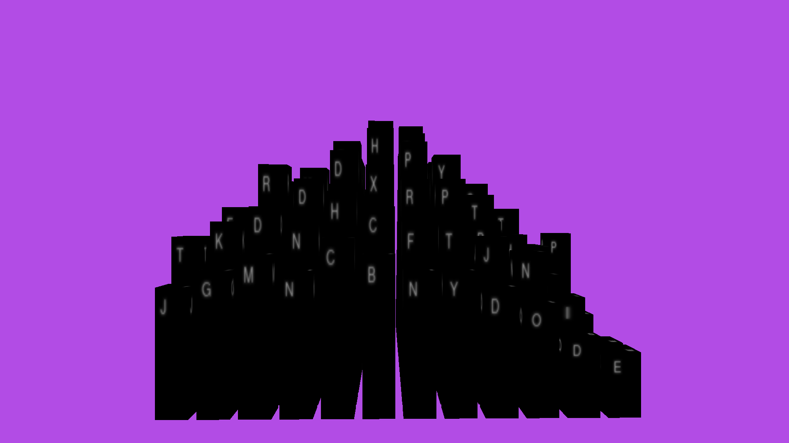

# TopologicalWordSearch
A new take on the standard wordsearch puzzle

Rather than a 2D topdown view, a 3D series of towers only visible at certain angles adds depth to the classic puzzle. This program can create NxN towers and generate sets such that each tower is visible from at least one side. 

This was inspired by the TOWERS PUZZLE by [Unkown9](https://unknown9.com/)

## How to Run

    TopologicalWordSearch.py Dictionary GridSize

The default dictionary can be found in assets/dictionaries/words.txt

## Screenshots

